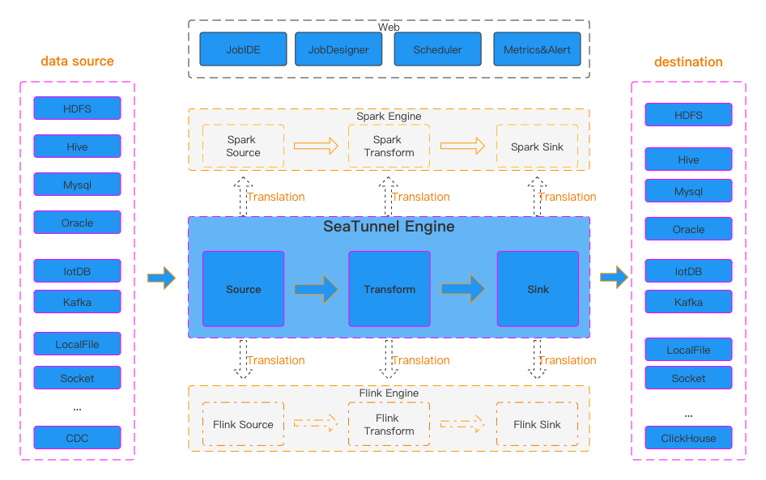

# 关于 SeaTunnel

SeaTunnel是一个非常易用、超高性能的分布式数据集成平台，支持实时海量数据同步。 每天可稳定高效同步数百亿数据，已被近百家企业应用于生产。

## 我们为什么需要 SeaTunnel

SeaTunnel专注于数据集成和数据同步，主要旨在解决数据集成领域的常见问题：

- 数据源多样：常用数据源有数百种，版本不兼容。 随着新技术的出现，更多的数据源不断出现。 用户很难找到一个能够全面、快速支持这些数据源的工具。
- 同步场景复杂：数据同步需要支持离线全量同步、离线增量同步、CDC、实时同步、全库同步等多种同步场景。
- 资源需求高：现有的数据集成和数据同步工具往往需要大量的计算资源或JDBC连接资源来完成海量小表的实时同步。 这增加了企业的负担。
- 缺乏质量和监控：数据集成和同步过程经常会出现数据丢失或重复的情况。 同步过程缺乏监控，无法直观了解任务过程中数据的真实情况。
- 技术栈复杂：企业使用的技术组件不同，用户需要针对不同组件开发相应的同步程序来完成数据集成。
- 管理和维护困难：受限于底层技术组件（Flink/Spark）不同，离线同步和实时同步往往需要分开开发和管理，增加了管理和维护的难度。

## Features of SeaTunnel

- 丰富且可扩展的Connector：SeaTunnel提供了不依赖于特定执行引擎的Connector API。 基于该API开发的Connector（Source、Transform、Sink）可以运行在很多不同的引擎上，例如目前支持的SeaTunnel Engine、Flink、Spark等。
- Connector插件：插件式设计让用户可以轻松开发自己的Connector并将其集成到SeaTunnel项目中。 目前，SeaTunnel 支持超过 100 个连接器，并且数量正在激增。 这是[当前支持的连接器]的列表(Connector-v2-release-state.md)
- 批流集成：基于SeaTunnel Connector API开发的Connector完美兼容离线同步、实时同步、全量同步、增量同步等场景。 它们大大降低了管理数据集成任务的难度。
- 支持分布式快照算法，保证数据一致性。
- 多引擎支持：SeaTunnel默认使用SeaTunnel引擎进行数据同步。 SeaTunnel还支持使用Flink或Spark作为Connector的执行引擎，以适应企业现有的技术组件。 SeaTunnel 支持 Spark 和 Flink 的多个版本。
- JDBC复用、数据库日志多表解析：SeaTunnel支持多表或全库同步，解决了过度JDBC连接的问题； 支持多表或全库日志读取解析，解决了CDC多表同步场景下需要处理日志重复读取解析的问题。
- 高吞吐量、低延迟：SeaTunnel支持并行读写，提供稳定可靠、高吞吐量、低延迟的数据同步能力。
- 完善的实时监控：SeaTunnel支持数据同步过程中每一步的详细监控信息，让用户轻松了解同步任务读写的数据数量、数据大小、QPS等信息。
- 支持两种作业开发方法：编码和画布设计。 SeaTunnel Web 项目 https://github.com/apache/seatunnel-web 提供作业、调度、运行和监控功能的可视化管理。

## SeaTunnel work flowchart

SeaTunnel的运行流程如上图所示。

用户配置作业信息并选择提交作业的执行引擎。

Source Connector负责并行读取数据并将数据发送到下游Transform或直接发送到Sink，Sink将数据写入目的地。 值得注意的是，Source、Transform 和 Sink 可以很容易地自行开发和扩展。

SeaTunnel 是一个 EL(T) 数据集成平台。 因此，在SeaTunnel中，Transform只能用于对数据进行一些简单的转换，例如将一列的数据转换为大写或小写，更改列名，或者将一列拆分为多列。

SeaTunnel 使用的默认引擎是 [SeaTunnel Engine](seatunnel-engine/about.md)。 如果您选择使用Flink或Spark引擎，SeaTunnel会将Connector打包成Flink或Spark程序并提交给Flink或Spark运行。

## 连接器

- **源连接器** SeaTunnel 支持从各种关系、图形、NoSQL、文档和内存数据库读取数据； 分布式文件系统，例如HDFS； 以及各种云存储解决方案，例如S3和OSS。 我们还支持很多常见SaaS服务的数据读取。 您可以在[此处] 访问详细列表。 如果您愿意，您可以开发自己的源连接器并将其轻松集成到 SeaTunnel 中。

- **转换连接器** 如果源和接收器之间的架构不同，您可以使用转换连接器更改从源读取的架构，使其与接收器架构相同。

- **Sink Connector** SeaTunnel 支持将数据写入各种关系型、图形、NoSQL、文档和内存数据库； 分布式文件系统，例如HDFS； 以及各种云存储解决方案，例如S3和OSS。 我们还支持将数据写入许多常见的 SaaS 服务。 您可以在[此处]访问详细列表。 如果您愿意，您可以开发自己的 Sink 连接器并轻松将其集成到 SeaTunnel 中。

## Who uses SeaTunnel

SeaTunnel 拥有大量用户。 您可以在[用户](https://seatunnel.apache.org/user)中找到有关他们的更多信息.

## Landscapes

  
&nbsp;&nbsp;
  
SeaTunnel 丰富了<a href="https://landscape.cncf.io/card-mode?category=streaming-messaging&license=apache-license-2-0&grouping=category&selected=sea-tunnal">CNCF 云原生景观</a >。

## Learn more

您可以参阅[快速入门](/docs/category/start-v2/locally/deployment) 了解后续步骤。
